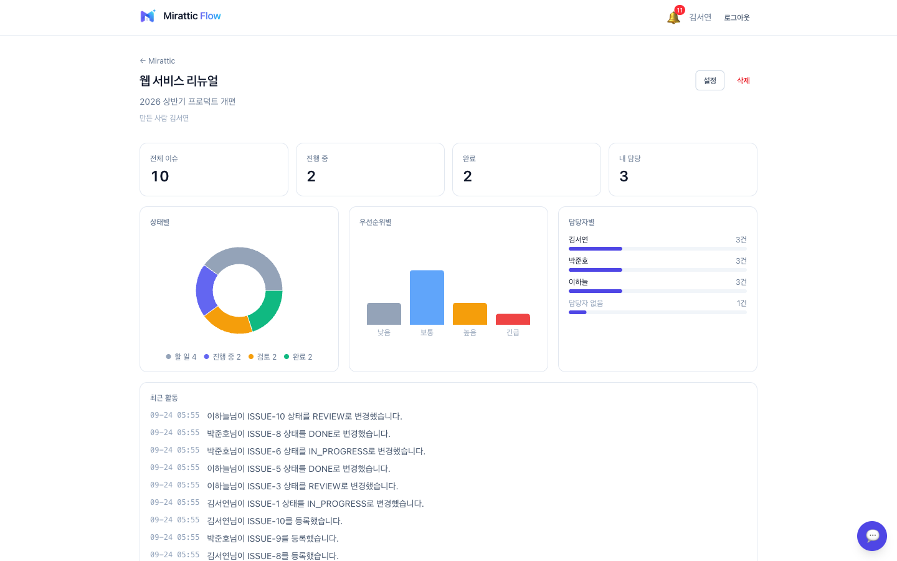
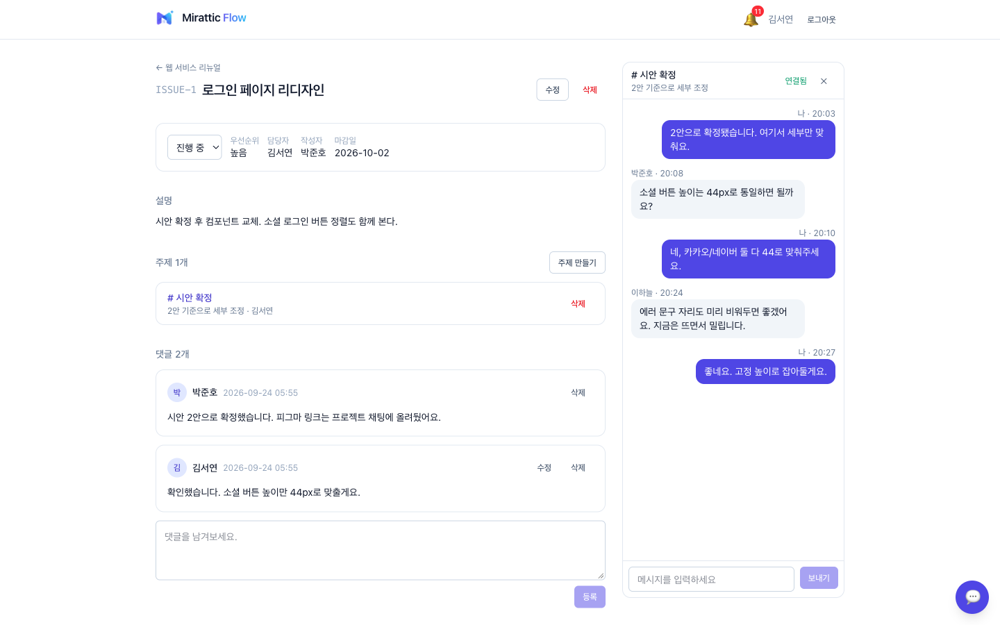
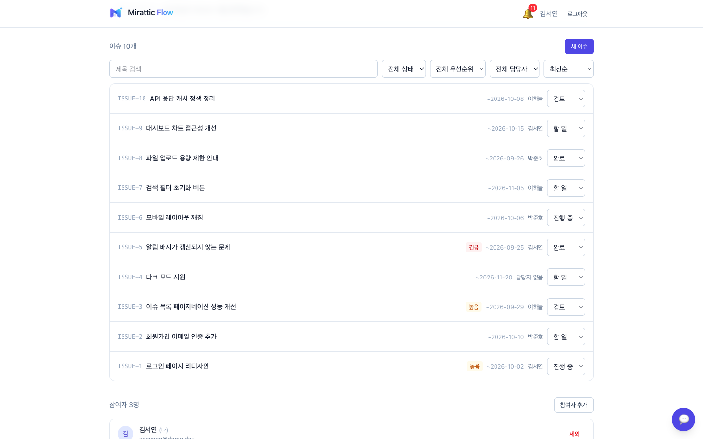
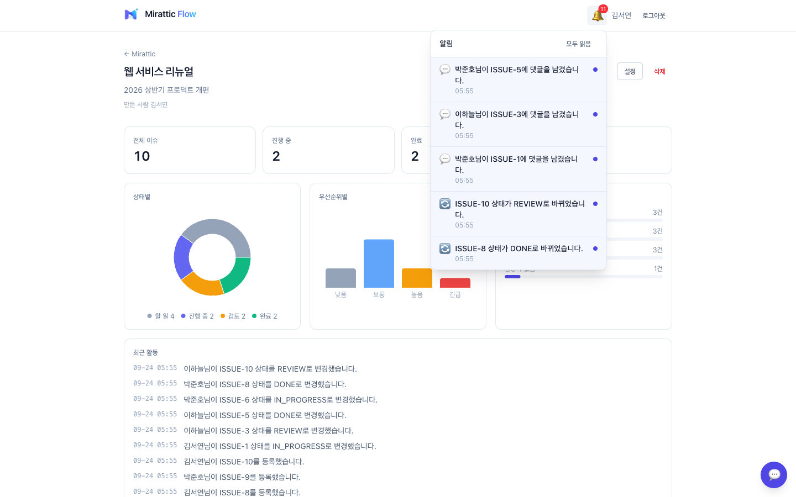
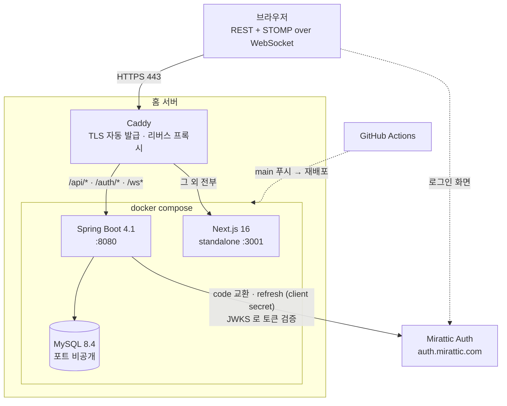

# Mirattic Flow

팀 협업 · 이슈 관리 서비스. 워크스페이스 안에서 프로젝트와 이슈를 관리하고,
실시간 채팅과 알림으로 소통합니다.

**🔗 [flow.mirattic.com](https://flow.mirattic.com)** — 홈 서버에 배포되어 있습니다. `main` 에 푸시하면 자동으로 갱신됩니다.

| | |
| --- | --- |
| 백엔드 | Java 21 · Spring Boot 4.1 · Spring Data JPA · Spring Security · WebSocket(STOMP) |
| 프론트엔드 | Next.js 16 · React 19 · TypeScript · Tailwind CSS 4 · TanStack Query |
| 데이터베이스 | MySQL 8.4 |
| 인프라 | Docker Compose · Caddy · GitHub Actions |
| 규모 | 테이블 12개 · REST 엔드포인트 51개 · 백엔드 테스트 86개 |

---

## 화면

| 프로젝트 대시보드 | 이슈 상세 + 분할 채팅 |
| --- | --- |
|  |  |

| 이슈 목록 | 알림 |
| --- | --- |
|  |  |

## 기능

- **인증** — Mirattic 계정(Mirattic Sync 와 공유하는 OAuth 2.0 / OIDC 서버) 로그인: 이메일 · 카카오 · 네이버. 토큰은 HttpOnly 쿠키, Access 15분 + Refresh 30일 rotation
- **워크스페이스** — 생성, 일회용 초대 링크와 상시 참여 코드, OWNER / MEMBER 역할
- **프로젝트** — 워크스페이스 안의 프로젝트, 참여자 관리, 보관(ARCHIVED)
- **이슈** — 상태 · 우선순위 · 담당자 · 마감일, 검색 / 필터 / 정렬 / 페이지네이션, 목록에서 상태 즉시 변경
- **댓글** — 이슈별 댓글, 작성자 수정 / 작성자·관리자 삭제
- **실시간 채팅** — 프로젝트마다 고정 채팅방 1개(우측 하단 독) + 이슈 안에서 만드는 주제(화면 분할)
- **알림** — 담당자 지정 · 상태 변경 · 댓글 · 프로젝트 초대 시 종 배지
- **대시보드** — 상태별 / 우선순위별 / 담당자별 집계와 최근 활동

## 아키텍처


```mermaid
flowchart TB
    B["브라우저<br/>REST + STOMP over WebSocket"]

    subgraph host["홈 서버"]
        CA["Caddy<br/>TLS 자동 발급 · 리버스 프록시"]
        subgraph compose["docker compose"]
            FE["Next.js 16<br/>standalone :3001"]
            BE["Spring Boot 4.1<br/>:8080"]
            DB[("MySQL 8.4<br/>포트 비공개")]
        end
    end

    GH["GitHub Actions"]

    B -->|"HTTPS 443"| CA
    CA -->|"/api/* · /auth/* · /ws*"| BE
    CA -->|"그 외 전부"| FE
    BE --> DB
    GH -.->|"main 푸시 → 재배포"| compose
    AU["Mirattic Auth<br/>auth.mirattic.com"]
    B -.->|"로그인 화면"| AU
    BE -->|"code 교환 · refresh (client secret)<br/>JWKS 로 토큰 검증"| AU
```

프런트와 API가 **같은 도메인**을 씁니다. 그래서 운영에는 CORS 설정이 사실상 필요 없고,
`https://` 페이지에서 WebSocket 주소도 자연스럽게 `wss://` 가 됩니다.

MySQL은 포트를 밖으로 열지 않습니다. 호스트에서 열려 있는 건 Caddy의 80 · 443 둘뿐입니다.

데이터 모델은 **[ERD 문서](docs/erd.md)** 에 있습니다.

---

## 주요 기술 결정

### 1. 인증을 Mirattic Auth 에 맡기고, 토큰은 HttpOnly 쿠키에만 둔다

처음에는 Flow 가 가입 · 로그인 · 소셜 로그인 · JWT 발급을 모두 직접 했습니다. 같은 사람이 쓰는 Mirattic Sync 가
생기면서 계정을 한 곳(Mirattic Auth, OAuth 2.0 + OpenID Connect)으로 모았습니다.

- Flow 백엔드는 **기밀 클라이언트**입니다. `/auth/start` 에서 state · PKCE 를 만들어 Auth 로 보내고,
  `/auth/callback` 에서 client secret 으로 code 를 토큰으로 바꿉니다. secret 은 서버에만 있습니다.
- Flow 가 자기 토큰을 새로 발급하지 않고 **Auth 의 access token 을 그대로** 씁니다 (JWKS 로 서명 · iss · aud 검증).
  Auth 에서 계정을 막거나 비밀번호를 바꾸면 최대 15분 안에 Flow 에도 반영됩니다.
- 토큰은 **HttpOnly 쿠키**(`flow_at` 15분, `flow_rt` 30일 · `/api/auth` 경로 한정)에만 있습니다.
  예전처럼 localStorage 에 두면 XSS 한 번에 토큰이 새어 나갑니다.
- 쿠키 인증은 CSRF 를 부르므로 상태를 바꾸는 요청에 `X-Requested-With: flow` 헤더를 요구합니다.
  다른 사이트의 폼은 커스텀 헤더를 붙일 수 없고, 다른 출처의 fetch 는 CORS 사전 요청에서 막힙니다.
- Flow 사용자는 숫자 id 를 그대로 두고 `mirattic_uid` 한 칸으로 Auth 계정과 연결했습니다.
  모든 테이블의 외래키를 UUID 로 바꾸는 것보다 변경이 훨씬 작습니다.

### 1-1. WebSocket 인증은 핸드셰이크 쿠키 + STOMP CONNECT

브라우저의 WebSocket API는 **핸드셰이크에 커스텀 헤더를 붙일 수 없습니다.** 토큰은 스크립트가 못 읽는
HttpOnly 쿠키에 있으므로 CONNECT 헤더로 보낼 수도 없습니다. 같은 출처의 핸드셰이크에는 쿠키가 붙으므로,
핸드셰이크에서 쿠키 값을 세션 속성으로 옮겨 두고 **STOMP CONNECT 프레임에서 REST 와 같은 JwtDecoder 로 검증**합니다.
(쿼리스트링 `?token=` 은 접근 로그에 토큰이 남아 쓰지 않습니다.)

인증만으로는 부족합니다. 거기서 멈추면 **로그인한 사람 누구나 남의 프로젝트 주제를 구독할 수 있습니다.**
같은 인터셉터에서 SUBSCRIBE · SEND 프레임의 목적지도 검사합니다 — 목적지는 클라이언트가 보내는 값이라 믿지 않습니다.

```java
case CONNECT   -> authenticate(accessor);
case SUBSCRIBE -> requireTopicAccess(accessor, "/topic/thread/");
case SEND      -> requireTopicAccess(accessor, "/app/thread/");
```

### 2. 권한 검사를 서비스 진입점 한 곳에 모은다

컨트롤러에는 권한 검사 코드가 한 줄도 없습니다. 검사는 도메인을 따라 한 방향으로만 흐릅니다.

```
WorkspaceService.requireMember / requireOwner
  └ ProjectService.requireAccess / requireManager
      └ IssueService.requireReadable
          └ TopicService.requireAccess · CommentService
```

덕분에 이슈 API를 추가할 때 `requireAccess` 를 한 번 부르면 프로젝트의 권한 규칙이 그대로 상속됩니다.
채팅을 붙일 때도 **채팅용 권한 코드를 새로 쓰지 않았습니다.**

같은 이유로 "이 사람이 이걸 관리할 수 있는가"(`canManage`)는 **서버가 계산해서 응답에 담습니다.**
프런트가 `createdByName === me.name` 같은 식으로 다시 판단하면 규칙이 두 곳에 생기고,
한쪽만 고치는 순간 조용히 어긋납니다.

### 3. 실시간을 쓴 곳과 일부러 쓰지 않은 곳

WebSocket이 이미 있으니 알림도 밀 수 있었습니다. 그런데 채팅 독을 접으면 STOMP 연결을 끊도록 정했고,
알림 때문에 연결을 계속 붙잡으면 그 결정이 무의미해집니다.

**알림은 30초 폴링입니다.** 그것도 안 읽은 **개수 하나만** 받습니다. 목록은 종을 눌렀을 때만 받습니다.
배지에 필요한 건 숫자 하나인데 50건을 30초마다 실어 나를 이유가 없어서 `/unread-count` 를 따로 뒀습니다.

알림은 몇 초 늦어도 되는 정보입니다. 채팅처럼 초 단위로 오가는 것과 성격이 다릅니다.

### 4. 알림 문장을 만들 때 굳혀서 저장한다

`type` 과 참조 id만 저장하고 읽을 때 조립할 수도 있습니다. 그러면 두 가지가 따라옵니다.

- 목록을 읽을 때마다 이슈 · 댓글을 다시 조회해야 합니다 (N+1)
- **이슈 제목을 바꾸면 과거 알림 문장까지 소급해서 바뀝니다**

알림은 그 시점에 일어난 사건의 기록입니다. 그래서 문장을 그때 완성해 넣습니다.
결과적으로 목록 질의에 조인이 하나도 없습니다.

### 5. 세는 일은 DB가 한다

대시보드를 만드는 가장 쉬운 방법은 이슈를 전부 받아 자바에서 `groupingBy` 하는 것입니다.
30건일 때는 잘 돕니다. **3,000건이 되면 화면을 열 때마다 3,000건을 메모리로 끌어옵니다.**

```java
@Query("""
        select new com.mirattic.flow.issue.dto.StatusCount(i.status, count(i))
        from Issue i where i.project.id = :projectId
        group by i.status""")
List<StatusCount> countByStatus(@Param("projectId") Long projectId);
```

`group by` 결과를 `Object[]` 로 받아 캐스팅하는 대신 **JPQL 생성자 표현식**으로 레코드에 바로 담습니다.
타입이 유지되고 매핑 코드가 사라집니다.

세 축을 `group by status, priority, assignee` 하나로 묶지 않은 이유는 조합의 **곱**이 나오고
**0건인 조합은 결과에 아예 없어서** 결국 화면이 다시 집계해야 하기 때문입니다.
작은 `group by` 세 번이 더 싸고, 각각이 그대로 화면의 한 덩어리가 됩니다.
0건 채우기는 서버가 합니다 — "완료 0건"이 차트에서 사라지면 안 됩니다.

---

## 트러블슈팅

### 폐기한 Refresh Token이 계속 통했다 (Mirattic Auth 이전 전, 자체 JWT 시절)

재발급을 두 번 연속 호출했더니, 첫 번째에서 폐기됐어야 할 토큰으로 두 번째 재발급이 성공했습니다.
rotation이 동작하지 않았습니다.

DB를 열어보니 행은 정상적으로 지워지고 있었습니다. **문제는 JWT 자체였습니다.** payload가
`sub` · `email` · `iat` · `exp` 뿐인데 `iat` 은 초 단위입니다. 같은 사용자가 **같은 초 안에** 재발급을 받으면
payload가 완전히 같아져 새 토큰이 이전 것과 바이트 단위로 동일해집니다.
"이전 토큰을 지우고 똑같은 값을 다시 넣는" 동작이 된 것입니다.

`jti`(UUID) 클레임을 추가해 매번 다른 토큰이 되게 했습니다. 회귀를 막으려고 테스트 두 개를 남겼습니다.

> 시간 기반 값만으로 고유성을 기대하면 안 된다는 것, **"DB에서 지웠으니 폐기됐다"는 가정이
> 값의 동일성 때문에 깨질 수 있다**는 것을 확인한 사례입니다.

### 동시 요청이 401을 받으면 로그아웃돼 버린다

화면 진입 시 API를 여러 개 동시에 호출하는데 access token이 만료돼 있으면, 전부 401을 받고
각자 재발급을 시도합니다. refresh token 을 rotation하므로 **첫 번째만 성공합니다.**
나머지는 이미 폐기된 토큰으로 요청하게 되어 실패하고, 실패 처리가 토큰을 지워 로그아웃됩니다.
재발급 정책과 클라이언트 동시성이 충돌한 경우입니다.

진행 중인 재발급 Promise 하나를 모듈 스코프에서 공유합니다.

```ts
refreshPromise ??= fetch('/api/auth/refresh', { method: 'POST', ... }).finally(() => { refreshPromise = null; });
```

동시에 몇 개가 401을 받아도 재발급은 한 번만 일어납니다.
통계 API를 여러 개 동시에 쏘는 대시보드에서 바로 드러났을 문제를 미리 막았습니다.

### 빈 순환 참조 — 메시징 기반 구조가 서비스보다 먼저 만들어진다

WebSocket을 붙이자 애플리케이션이 아예 뜨지 않았습니다.
`The dependencies of some of the beans form a cycle`.

```
StompAuthInterceptor → TopicService → ProjectService → SystemMessageSender
  → SimpMessagingTemplate → DelegatingWebSocketMessageBrokerConfiguration
  → WebSocketConfig → StompAuthInterceptor
```

WebSocket 메시징 기반 구조는 애플리케이션 서비스보다 **먼저** 만들어져야 하는데,
그 인터셉터 안에서 서비스를 쓰려 한 것입니다.

인터셉터가 `TopicService` 를 `ObjectProvider<TopicService>` 로 받게 했습니다.
프레임이 들어오는 시점에는 모든 빈이 준비돼 있으니 그때 꺼내 씁니다.
`@Lazy` 프록시 대신 이걸 고른 이유는 **"지금이 아니라 나중에 꺼낸다"는 의도가 코드에 드러나서**입니다.

### 프로젝트를 지우면 500 — JPA는 삭제 순서를 보장하지 않는다

`Referential integrity constraint violation: TOPICS FOREIGN KEY(PROJECT_ID)`.

연쇄 삭제를 서비스가 순서대로 호출하고 있었는데도 터졌습니다. Spring Data의 파생 삭제
(`deleteByProjectId`)는 엔티티를 읽어 `em.remove` 만 하고, **실제 DELETE는 커밋 시점에
Hibernate가 정한 순서로** 나갑니다. 부모가 자식보다 먼저 지워질 수 있습니다.
그동안 통과했던 건 순서가 **우연히** 맞았기 때문입니다.

연쇄 삭제 8곳을 전부 `@Modifying` JPQL 벌크 삭제로 바꿨습니다.
벌크 쿼리는 호출 즉시 SQL이 나가므로 **코드에 적힌 순서가 곧 실행 순서**가 됩니다.

### 운영 스택이 개발 DB를 집어 들었다

배포 구성을 로컬에서 시험하자 백엔드가 `Access denied for user 'root'` 로 재시작을 반복했습니다.

Compose는 프로젝트 이름을 **디렉터리 이름**으로 정합니다. 같은 폴더의 `docker-compose.yml`(개발)과
`docker-compose.prod.yml`(운영)이 둘 다 `miratticflow` 프로젝트가 되어
**`miratticflow_mysql-data` 볼륨을 공유했습니다.** 운영 스택이 개발용 비밀번호로 초기화된 DB를 집어 든 것입니다.

```yaml
name: mirattic-flow-prod
```

서버에는 스택이 하나뿐이라 안 드러났을 수도 있습니다. 하지만 같은 머신에서 운영 구성을 시험하는 순간
**개발 DB를 덮어쓰거나 운영이 옛 데이터로 뜹니다.**

### WebSocket 확인이 400으로 보였다

`curl` 로 업그레이드를 시험했더니 400이 났습니다. Caddy 문제가 아니라 **curl이 HTTP/2로 붙어서**였습니다 —
WebSocket 업그레이드는 HTTP/1.1에서만 성립합니다. `--http1.1` 을 주니 `101 Switching Protocols` 가 나왔습니다.

브라우저는 WebSocket을 열 때 알아서 HTTP/1.1을 씁니다. 실제로는 멀쩡했고,
**시험 도구 때문에 정상 설정을 고칠 뻔했습니다.**

---

## 로컬 실행

```bash
cp .env.example .env
docker compose up -d                    # MySQL 8.4

# Mirattic Auth 를 local 프로파일로 띄운다 (Auth 저장소, http://127.0.0.1:9000, dev client secret 내장)
cd backend && ./mvnw spring-boot:run    # http://127.0.0.1:8080

cd frontend && cp .env.local.example .env.local && npm install && npm run dev
# http://127.0.0.1:3000 으로 연다 (localhost 가 아니라). Auth 에 등록된 개발용 redirect 가 127.0.0.1 이고,
# 로그인 쿠키도 그 호스트에 붙는다. /api · /auth 는 개발 서버가 백엔드로 넘긴다.
```

```bash
cd backend && ./mvnw test     # 108개 (Mirattic Auth 는 테스트에서 JDK HTTP 서버 스텁)
cd frontend && npm run build  # 타입 체크 겸용
```

카카오 · 네이버 로그인은 Mirattic Auth 가 처리합니다 (Flow 에는 소셜 로그인 키가 없습니다).

<details>
<summary><b>배포</b></summary>

`main` 에 푸시하거나 GitHub Actions의 `Deploy` 를 수동 실행하면
서버에서 소스를 갱신하고 Docker Compose로 빌드 · 재배포합니다.

```bash
docker compose -f docker-compose.prod.yml --env-file .env.prod up -d --build
```

- 배포는 **fast-forward만** 허용하며 서버의 로컬 변경을 강제로 초기화하지 않습니다
- `.env.prod` 는 서버에만 두고 Git에 올리지 않습니다 (`.env.prod.example` 참고)
- 운영 프로필은 `AUTH_CLIENT_SECRET`(Mirattic Auth client `mirattic-flow`)에 **기본값이 없습니다.** 빠뜨리면 기동에 실패합니다
- Caddy는 호스트에서 공용 서비스로 돌며 `Caddyfile.example` 이 설정 예시입니다. 앱 배포가 Caddy를 재시작하지 않습니다
- 인증서는 Let's Encrypt에서 자동 발급 · 갱신됩니다

</details>

---

## AI 에이전트와 협업

Claude Code와 함께 만들었습니다. 코드를 생성시키는 것보다 **생성 방식을 설계하는 일**에 더 신경 썼습니다.

**규칙을 파일로 고정했습니다.** [`CLAUDE.md`](CLAUDE.md) 에 도메인별 패키지 구조, `open-in-view=false`,
엔티티를 컨트롤러 밖으로 내보내지 않기 같은 규칙을 적어두면 매번 지적할 필요가 없습니다.
**"하지 말 것" 목록이 더 중요했습니다** — 과도한 추상화, 구현 하나짜리 인터페이스, MSA/Kubernetes.
에이전트는 시키면 다 만들어 주기 때문에, 만들지 않을 것을 먼저 정해두는 쪽이 효과가 컸습니다.

**구현 전에 설명을 먼저 받았습니다.** Phase마다 ① 어떤 구조로 ② 어떤 파일을 ③ 데이터가 어떻게 흐르는지를
받아 확인한 뒤에 구현을 시작했습니다. 느려 보이지만, 설계 단계에서 되돌리는 편이 코드가 쌓인 뒤보다 훨씬 쌉니다.
무엇보다 **면접에서 내가 설명하지 못하는 코드는 포트폴리오가 아니라고 생각했습니다.**
이 README의 [주요 기술 결정](#주요-기술-결정) 5개는 그 확인 단계에서 정리된 것들입니다.

**학습 데이터 밖의 기술은 문서를 읽히게 했습니다.** Next.js 16은 에이전트가 알고 있는 Next.js와 다릅니다.
[`frontend/AGENTS.md`](frontend/AGENTS.md) 로 추측 대신 `node_modules/next/dist/docs/` 의
설치된 버전 문서를 먼저 읽도록 했습니다. 버전이 앞서가는 프레임워크에서는 이 한 줄이 잘못된 API 사용을 막아줍니다.

**"완료" 는 돌려보기 전까지 완료가 아닙니다.** 위 [트러블슈팅](#트러블슈팅) 은 전부 코드가 그럴듯하게
작성된 **이후에** 테스트·실행·배포에서 드러난 문제들입니다. 폐기한 Refresh Token이 계속 통하던 버그는
테스트를 짜지 않았다면 그대로 배포됐을 겁니다. 검증까지가 사람 몫이라고 보고 그렇게 진행했습니다.

Phase별 구현 기록(설계 · 결정 이유 · 트러블슈팅 · 검증 · 한계)은 따로 문서로 남겼고,
이 README의 기술 결정과 트러블슈팅은 그 기록에서 추린 것입니다.

> 상세 기획은 [기획안.txt](기획안.txt) 참고.
