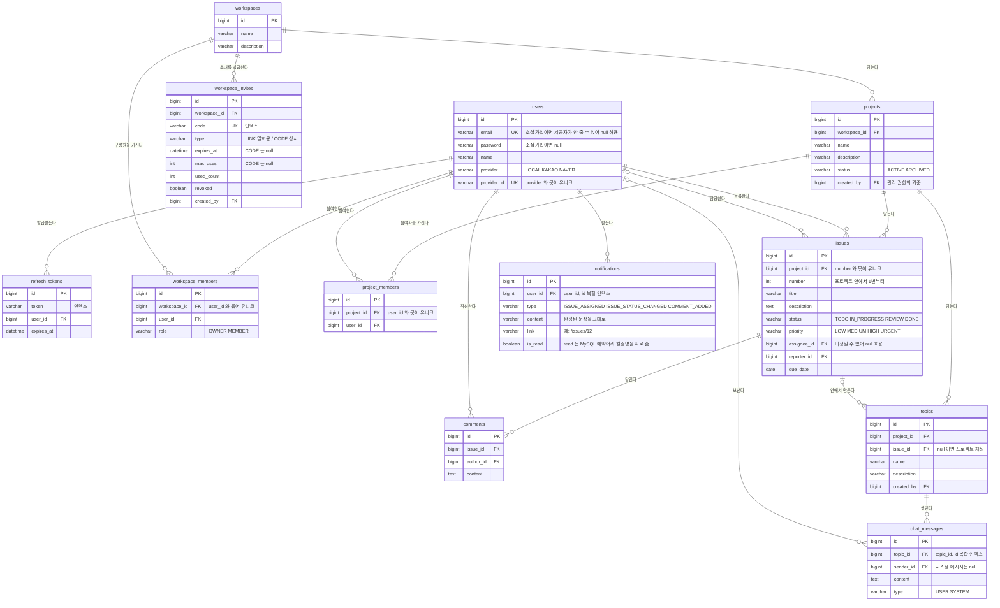

# ERD

테이블 12개. 스키마는 JPA 엔티티가 원본이고(`spring.jpa.hibernate.ddl-auto=update`),
이 문서는 그것을 사람이 읽는 형태로 옮긴 것입니다.

모든 테이블은 `created_at` / `updated_at` 을 가집니다(`BaseTimeEntity`,
`AuditingEntityListener` 가 채웁니다). `refresh_tokens` 만 예외로,
수명이 토큰 자체에 `expires_at` 으로 들어 있어 상속하지 않습니다.

## 설계에서 설명이 필요한 곳

### topics.issue_id 가 nullable 인 이유

채팅이 두 군데에 있습니다. **프로젝트마다 하나씩 고정으로 있는 채팅방**과,
**이슈 안에서 만드는 주제**입니다. 테이블을 둘로 나눌 수도 있었지만
메시지·권한·삭제 로직이 완전히 같아서 `chat_messages` 도 둘로 갈라지거나
어느 쪽을 가리키는지 분기하는 컬럼이 생깁니다.

한 테이블에 두고 `issue_id` 의 null 여부로 구분합니다. 이슈 주제도
`project_id` 를 함께 들고 있어서, 프로젝트 기준으로 짜인 기존 권한 검사와
연쇄 삭제 질의를 **한 줄도 고치지 않고** 그대로 씁니다.

### issues.number 가 따로 있는 이유

PK 는 전역 시퀀스라 사용자에게 의미가 없습니다. "3번 이슈"는 프로젝트 안에서
세 번째라는 뜻이어야 읽힙니다. `(project_id, number)` 유니크 제약으로
동시에 등록해도 번호가 겹치지 않게 막습니다.

### project_members 에 역할이 없는 이유

관리 권한은 `projects.created_by` 와 워크스페이스 `OWNER` 로 이미 정해집니다.
여기에 역할 컬럼을 또 두면 **같은 질문에 대답이 두 개** 생기고, 둘이 어긋나는
순간 어느 쪽이 맞는지 알 수 없습니다. 이 테이블은 "누가 이 프로젝트에 속하는가"
하나만 답합니다. 이슈 담당자 후보와 채팅 입장 권한이 그 답을 씁니다.

### notifications.content 에 문장을 통째로 넣은 이유

`type` 과 참조 id 만 저장하고 읽을 때 조립하는 방법도 있습니다. 그러면 목록을
한 번 읽을 때마다 이슈와 댓글을 다시 조회해야 하고(N+1), **이슈 제목을 바꾸면
과거 알림 문장까지 소급해서 바뀝니다.** 알림은 그 시점에 일어난 사건의 기록이라
문장을 그때 굳힙니다. 덕분에 목록 질의에 조인이 하나도 없습니다.
